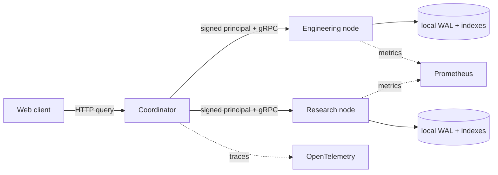

# PrivateMesh

PrivateMesh is a distributed search system that keeps documents and indexes on the nodes that own
them. A coordinator authenticates the caller, chooses a retrieval strategy, fans the query out,
and merges ranked results. It never becomes a central document store.

The project implements lexical BM25 search, exact and HNSW vector search, hybrid rank fusion,
deadline-aware planning, durable local writes, signed identity propagation, node-local policy
enforcement, partial results, and an observable multi-node deployment.



## Run it

Requirements are Docker Desktop with Compose v2 and GNU Make.

```bash
docker compose -f deployments/compose/compose.yaml up -d --build
```

Open these local endpoints after the containers become healthy:

| Service | URL |
|---|---|
| Search application | http://127.0.0.1:18000 |
| Coordinator API | http://127.0.0.1:18080 |
| Grafana dashboard | http://127.0.0.1:13000/d/privatemesh-overview/privatemesh-overview |
| Prometheus | http://127.0.0.1:19090 |
| Jaeger | http://127.0.0.1:16686 |

The local deployment starts two independently persisted collections and seeds a small demonstration
corpus. Try `distributed search`, `replica recovery`, or `local ownership` in the browser.

The same path can be exercised directly:

```bash
curl --fail --silent --show-error \
  -H 'Content-Type: application/json' \
  --data '{"query":"distributed search","mode":"auto","limit":5}' \
  http://127.0.0.1:18080/api/search
```

Stop the environment without deleting node data:

```bash
make down
```

## What is implemented

- Unicode-aware lexical indexing with field-weighted BM25 and deterministic top-k ordering
- Local deterministic embeddings, exact vector search, HNSW, and reciprocal-rank fusion
- Relevance and recall evaluation for lexical and approximate retrieval
- Immutable, checksummed index segments and a committed write-ahead log with crash recovery
- Lease-backed node registration, deadline propagation, cancellation, fan-out, and global merging
- Explicit `unavailable_shard_ids` when a node cannot answer
- Primary election, replica catch-up, log compaction, and snapshot recovery primitives
- OIDC access-token verification and short-lived Ed25519 principal tokens between services
- Collection and document authorization at the node that owns the content
- Privacy-safe audit events, metrics, and traces that omit queries, document content, and identities
- React search interface, container images, Compose, Kubernetes overlays, and tag-based releases

## Verification

```bash
make check               # format, vet, lint, race tests, builds, and protocol validation
make load-test           # concurrent search traffic with latency and error budgets
make chaos-test          # kill a node, verify partial results, and wait for rejoining
make recovery-test       # write, restart, and verify WAL recovery
make benchmark-million   # deterministic one-million-document local index run
make kubernetes-config   # render both Kubernetes overlays
```

A reference Docker run on 8 vCPU `linux/arm64` indexed 1,000,000 deterministic documents in
4.55 seconds (219,763 documents/second), used 1,193 MiB of heap, and completed 500 searches at
0.201 ms p95. A separate live run completed 1,000 distributed HTTP searches at 2,749 requests per
second, 16.3 ms p95, and zero errors. These numbers describe one local run and are not production
capacity claims; every benchmark reports its seed, runtime, memory, throughput, and latency.

## Design boundaries

The coordinator sees query text and permitted snippets while a request is in flight, but it does
not persist source documents or build a global index. Search nodes remain authoritative and apply
authorization before returning results. Missing nodes reduce coverage rather than making the whole
query fail.

The included local environment is intentionally a demonstration configuration. A production
deployment must provide OIDC settings and fresh signing keys, encrypt ingress, and protect
service-to-service traffic with the cluster network or a service mesh. The current implementation
does not provide private-information retrieval or conceal a query from the nodes selected to answer
it.

See [architecture](docs/architecture.md), [threat model](docs/threat-model.md), [development
guide](docs/development.md), and [operator runbook](docs/operations.md) for the full design and
operational details.
